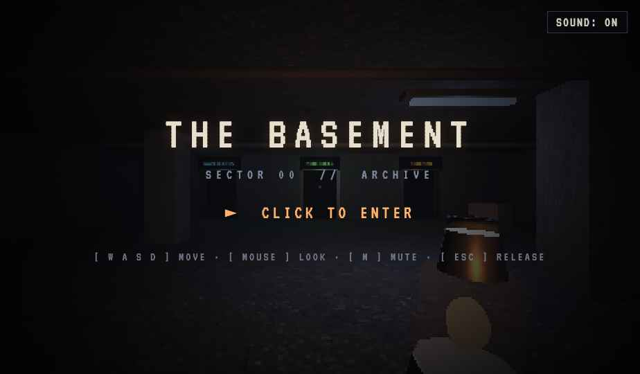

# THE BASEMENT — Sector 00 // Archive

A first-person, retro-horror **portfolio hub**. You wake in a concrete basement
lit only by a hand-held lantern. Three doors line the far wall — each a project.
Walk through one to enter its room.

> Built in three.js with a CRT look: pixelated low-res render, animated film
> grain, scanlines, vignette, flickering fluorescent + neon signage, and a
> procedural Web Audio drone (sub-bass hum, breath, footsteps, ballast buzz).



## Controls

| Action | Input |
| --- | --- |
| Enter / capture mouse | **Click** |
| Look | **Mouse** (drag, or move while pointer is captured) |
| Move | **W A S D** |
| Mute / unmute | **M** |
| Release the mouse | **Esc** |

Walk into a door to travel to a project room; walk through the **EXIT** to come
back to the hub.

## Run it

It's a single static file with no build step. Three.js loads from a CDN, so you
need a network connection and any static server (browsers block pointer-lock and
some fetches on `file://`):

```bash
# from the repo root — pick whichever you have
python3 -m http.server 8000
# or
npx serve .
```

Then open <http://localhost:8000/>.

## Layout

```
index.html              ← the site (standalone three.js, no dependencies bundled)
assets/projects/        ← in-world exhibit visuals shown on each room's monitor
  nautichess.png        ← NotiChess tactics-trainer screenshot
  foreman.png           ← Foreman v2 workspace UI (rendered from its design)
design/                 ← source-of-truth design export, kept for re-sync
  The Basement.dc.html  ← original Claude Design Component (<x-dc> + logic class)
  support.js            ← the Design Component runtime that mounts a .dc.html
  screenshots/          ← reference captures
README.md
```

## About the implementation

The design was authored in [claude.ai/design](https://claude.ai/design) as a
**Design Component** (`design/The Basement.dc.html`): an `<x-dc>` template plus a
`<script data-dc-script>` logic class (`class Component extends DCLogic`). That
runtime (`design/support.js`) loads React, parses the template, evaluates the
logic class, and mounts it.

`index.html` is a faithful **standalone port** of that component. The game logic
was already pure three.js + imperative DOM — React/`DCLogic` were only a thin
mount shell — so the port keeps the entire tuned game verbatim and replaces only
the shell:

- design-editor props (`atmosphere`, `lanternColor`, `neonColor`, `pixelation`,
  `grain`) become their defaults,
- the `ref`-bound template nodes become real DOM elements, and
- the React lifecycle becomes a single boot call.

The result runs with **no React, no Design Component runtime, and no build** —
just three.js from a CDN. The original export is kept under `design/` so the
component can still be edited in claude.ai/design and re-synced later.

## Project rooms

Each of the three doors opens onto a project room. Inside, a self-lit **monitor**
on one wall shows a visual of the project and a **placard** on the other wall
gives a short write-up (what it is, the stack, and where to find it). The
monitor's glowing bezel matches the door's accent colour.

| Door | Project | Visual | What it is |
| --- | --- | --- | --- |
| `NAUTICHESS` | [NotiChess](https://github.com/TsRun) | tactics-trainer screenshot | Desktop chess studio — play/import/organize games + a tactics trainer over ~4.1M real games (Tauri 2 · React · Rust). |
| `MINISHELL` | [minishell](https://github.com/TsRun/minishell) | procedural CRT terminal | École 42 systems project — a Bash-like shell in C (pipes, redirections, env, signals, builtins). |
| `FOREMAN` | [foreman](https://github.com/TsRun) | live workspace UI | macOS task queue for AI coding agents — auto-classifies & routes tasks to role agents that run in parallel and coordinate (Tauri 2 · React · Rust · SQLite). |

The two screenshot visuals live in `assets/projects/`; MINISHELL's terminal is
drawn procedurally at runtime (a C/shell project has no UI screenshot), and every
placard is rendered to a canvas in-engine — so only the two `.png`s are assets.
